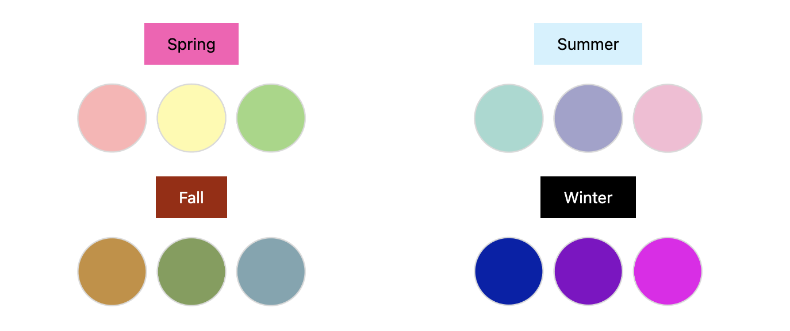

[깃허브 Organization 링크](https://github.com/SCHU-Colorlog)

순천향대학교 사물인터넷학과 '날아오르라 졸작이여' 팀 졸업작품  
AI 기반 퍼스널컬러 진단 기능을 탑재한 포토부스 <b>컬러로그</b>  

AI로 퍼스널컬러 진단 받고,
 
자신의 퍼스널컬러에 맞는 프레임 디자인과
 
색상조명을 활용해 네 컷 사진을 촬영해 보세요!

 

🎀 예시 결과물 🎀

 

## Team members 💻

| @yimethan | @hansanga | @yeohl | @Shs0160 |
|---|---|---|---|
|Team leader, ML/DL|Frontend, UI, Design|Hardware, Embedded system|Backend, Design|
|    |   |    |    |

 

## Hardware 🤖

#### 포토부스 외관

✔️ 퍼스널컬러 진단 시 외부 조명의 영향을 막기 위한 암막커튼과 천장 가림막 
✔️ 학교 대표색상과 조화를 이루기 위한 암막커튼 컬러 
✔️ 조립과 분해가 용이하면서 튼튼한 4040 규격의 프로파일 
✔️ 하단에 바퀴를 달아 이동성 부여 
✔️ 포토부스 앞면 (내부 부품들 가리는 판)은 문 형태로 제작해 유지보수 용이하게

#### 포토부스 내부

✔️ DSLR 카메라 (캐논 200D) 
✔️ DNP HS RX1 
✔️ 필립스휴 라이트바 플레이 더플팩 + 브릿지 
✔️ 공유기 
✔️ 패널형 백색조명 
✔️ 제우스랩 18.5인치 터치식 포터블 모니터 
✔️ 밟고 올라갈 수 있는 발판 
✔️ 막대형 자석부착 백색 조명

## Features 🎈

### 포토부스 이용 순서

1️⃣ 진단용 사진 1장 촬영 
2️⃣ AI 기반 퍼스널컬러 진단 수행 
3️⃣ 진단 결과 확인 
4️⃣ 퍼스널컬러 유형에 어울리는 세 가지 조명 옵션 중 하나 선택 
5️⃣ 네 컷 사진 촬영 
6️⃣ 여섯 가지 프레임 옵션 중 하나 선택 
7️⃣ 인쇄된 사진 수령  
8️⃣ 사진에 인쇄된 QR코드 통해 웹사이트 접속

#### 사용자 입장 파이프라인

 

### 웹사이트

✔️ 사진에 함께 인쇄된 QR코드 통해 접속 
✔️ 진단 받은 퍼스널컬러에 해당하는 웹사이트 디자인 
✔️ 진단 받은 유형에 대한 정보 확인 
✔️ 사진/영상 다운로드 
✔️ 진단 유형에 어울리는 추천 코스메틱 제품 목록

 

봄 웜톤|여름 쿨톤|가을 웜톤|겨울 쿨톤
---|---|---|---
 |  |  | 

 

### 포토부스 내 터치스크린 GUI

✔️ 아래는 실제 서비스 사용 중 화면 녹화 캡쳐본 
✔️ 기존 포토부스의 파이프라인에서 크게 벗어나지 않도록 구성 
✔️ 버튼, 타이머 등으로 재미있고 이해하기 쉽게 
✔️ 사진 촬영될 때 '찰칵' 효과음, 화면 이동 시 '뾰로롱' 효과음 
✔️ 학교 대표색상과 어우러지는 색상을 주로 사용

### 퍼스널컬러에 맞는 색상 조명 & 프레임 디자인

✔️ 조명 색상과 프레임 색상 옵션 중 하나를 선택해 네 컷 사진 촬영

#### 프레임 디자인

✔️ 총 6개 프레임에서 선택 가능 
✔️ 퍼스널컬러 유형에 맞는 세 가지 프레임 
✔️ 모든 유형에서 선택 가능한 흰색, 검정색, UIC엑스포 스페셜 프레임 추가

 

  <p1 style="background-color: #ff59b5; padding: 10px 20px; color: black;">Spring</p1> 

 |  | 
---|---|---

 

<p1 style="background-color: #d1f2ff; padding: 10px 20px; color: black;">Summer</p1>

 |  | 
---|---|---
  
 

<p1 style="background-color: #a12303; padding: 10px 20px; color: white;">Fall</p1> 

 |  | 
---|---|---

 

<p1 style="background-color: black; padding: 10px 20px; color: white;">Winter</p1>

 |  | 
---|---|---

 

<p1 style="background-color: white; padding: 10px 20px; color: black; border: 1px solid;">Default</p1>

| |
---|---|---

 

#### 색상 조명

✔️ 퍼스널컬러 유형에 맞는 세 가지 중 하나 선택 
✔️ 색상조명은 네 컷 사진을 촬영할 때를 제외하고 항상 백색으로 설정

 

#### 촬영한 사진 예시

초록색 조명 (막대조명 off)|분홍색 조명 (막대조명 on)|엑스포 프레임
---|---|---
 |  |

### Details

#### 퍼스널컬러 진단 방식

+ 진단용 사진으로부터의 특성 추출 과정

✔️ 각 대표색상의 HSV, Lab, RGB 값들을 평균 내 사용해 차원 축소 & 순위 제거 
✔️ 얼굴 명도 분산으로 이목구비의 뚜렷한 정도 구하기 
✔️ 머리카락, 홍채, 사람의 분위기, 이목구비 생김새 등은 사용하지 않음

+ 퍼스널컬러 진단 모델

✔️ 두 단계로 이뤄진 진단 프로세스 
✔️ 첫 단계에서 웜/쿨 이진 분류 
✔️ 두 번째 단계에서 웜일 시 봄/가을 이진분류, 쿨일 시 여름/겨울 이진분류

#### 아키텍처

### Awards and Activities

#### LINC3.0 캡스톤디자인 경진대회 `대상 (교육부 장관 겸 부총리상)` 수상

#### 2024 산학연협력엑스포 @벡스코 (Busan, Korea)

+ 3일 간 약 300명 이용 (전 연령대)
+ 봄: 분홍색, 여름: 하늘색, 가을: 벽돌색, 겨울 진보라색 프레임을 가장 많이 선택
+ 봄: 분홍색, 여름: 연보라색, 가을: 황토나 청색, 겨울 파란색 조명을 가장 많이 선택

#### 순천향대 중앙도서관 1층 로비 전시 (Asan, Korea)

+ 4일 (하루 3~4시간 운영) 간 약 180명 이용 (주로 20대 초반)
+ 기본 프레임을 주로 선택 (흰색, 검정색 - 분홍 계열이 없으면 엑스포 프레임을 선택하기도)
  + 러블리하거나 시크하거나 둘 중 하나일까?
+ 봄: 분홍색, 여름: 3, 가을: 3, 겨울: 2 조명을 가장 많이 선택

#### 특허 출원

#### 2024 SW인재페스티벌 @세종대 (Seoul, Korea)

#### 필리핀 바탄주립대학교 성과발표회 (Bataan, Philippines)
