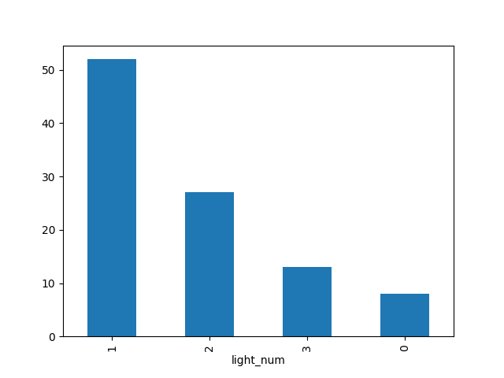

# Personal color photobooth

> 순천향대학교 사물인터넷학과 '날아오르라 졸작이여' 팀 졸업작품 
> 
> 퍼스널컬러 진단 기능을 탑재한 포토부스 **컬러로그**
>
> : AI기반 퍼스널컬러 진단 받고, 자신의 퍼스널컬러에 맞는 프레임 디자인과 색상조명을 활용해 네컷 사진을 촬용해 보세요!

## Team members

| @yimethan | @hansanga | @yeohl | @Shs0160 |
|---|---|---|---|
|Team leader, ML/DL|Frontend, UI, Design|Hardware, Embedded system|Backend, Design|
|    |   |    |   |

## Features

### AI 기반 퍼스널컬러 진단

### 퍼스널컬러에 맞는 코스메틱 제품 추천

### 퍼스널컬러에 맞는 색상 조명 & 프레임 디자인

#### 프레임 디자인

Spring

      

Summer

      

Fall

      

Winter

      

#### 색상 조명

  Spring

  

  Summer

  

  Fall

  

  Winter

  

## Details